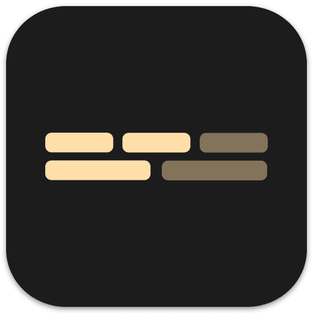

  
  
  <h3 align="center">Polytronome</h3>
  
Train your polyrythms ! 
     <a href="https://github.com/victrme/polytronome/issues">Contribute</a> · 
     <a href="https://github.com/victrme/polytronome#contact">Contact</a> · 
     <a href="https://github.com/victrme/polytronome#keybindings">Documentation</a>
     
  

# About

Polytronome helps you visualize polyrythms by layering multiple metronomes. Use it to discover new rythms, challenge yourself to play along difficult beats, or simply enjoy the melodies you created !

You can:

-   Add up to five rythms, and up to sixteen note
-   Change the note, type, release & volume for each rythms
-   Use the keyboard as a MIDI controller
-   Toggle between different views

# Keybindings

| Key                                  | Function               |
| ------------------------------------ | ---------------------- |
| `Space`                              | Start / Stop Metronome |
| `NumpadMinus` `Minus`                | Tempo down             |
| `NumpadPlus` `Equal`                 | Tempo Up               |
| `shift + Tempo up / down`            | +/-10 tempo            |
| `Digit0`                             | tempo tapping          |
| `Digit9`                             | Change rythm view      |
| `Digit8`                             | Fullscreeen            |
| `AltRight`                           | Shuffle rythms         |
| `1` `2` `3` `4` `5`, `←` `→` `↑` `↓` | Select rythm           |
| `Backspace`                          | Deselect rythm         |

| Key (with rythm selected)     | Function             |
| ----------------------------- | -------------------- |
| `shift + ↑` `shift + ↓`       | Change beats         |
| `M` (french iso: `?`)         | Volume mute          |
| `,` (french iso: `;`)         | Volume down          |
| `.` (french iso: `:`)         | Volume up            |
| `Z` (french iso: `W`)         | Keyboard octave down |
| `X`                           | Keyboard octave up   |
| `C`                           | Change wave type     |
| `V`                           | Change note duration |
| `B`                           | Change note release  |
| `A`                           | C                    |
| `W`                           | C#                   |
| `S`                           | D                    |
| `E`                           | D#                   |
| `D`                           | E                    |
| `F`                           | F                    |
| `T`                           | F#                   |
| `G`                           | G                    |
| `Y`                           | G#                   |
| `H`                           | A                    |
| `U`                           | A#                   |
| `J`                           | B                    |
| `K`                           | C+1                  |
| `O`                           | C#+1                 |
| `L`                           | D+1                  |
| `P`                           | D#+1                 |
| `Quote` (french iso: `M`)     | E+1                  |
| `Semicolon` (french iso: `ù`) | F+1                  |

# Contact

-   [Telegram - @victrm](https://t.me/victrm)
-   [Email - mail@victr.me](mailto:mail@victr.me)

# Todo

### Features

-   [ ] import / export rythms
-   [ ] tutorial translation
-   [x] Mobile menu responsive
-   [x] advanced tutorial
-   [x] Tempo tapping keymapping
-   [x] Better mute animation
-   [x] Keymappings

### Bugs

-   [x] No sound on safari
-   [x] Tempo state always default on resize effect (during mount)
-   [x] Tempo keyboard change doesn't reset metronome
-   [x] Sound offset for segment / block
-   [x] Update off animations
-   [x] Resize wheels on launch
-   [x] Reset to default on Firefox
-   [x] Volume breaking after moving
